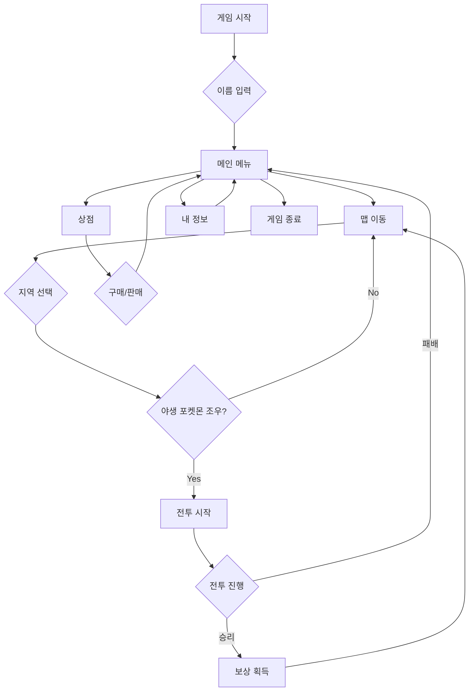
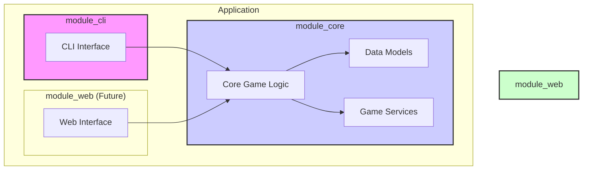

# 포켓몬스터 CLI 게임 프로젝트 개요

## 1. 주제선정 (이유)

*   **주제:** 포켓몬스터 CLI 게임
*   **선정 이유:**
    *   전 세계적으로 사랑받는 IP(지적 재산)인 포켓몬스터를 활용하여 사용자에게 친숙하고 흥미로운 게임 경험을 제공합니다.
    *   CLI(Command Line Interface) 환경은 그래픽 요소 없이 로직 구현에 집중할 수 있어, 객체 지향 프로그래밍(OOP)의 핵심 개념(캡슐화, 상속, 다형성)과 상태 패턴(State Pattern)과 같은 디자인 패턴을 학습하고 적용하기에 적합합니다.
    *   턴제 전투, 상점, 맵 이동 등 다양한 게임 요소를 통해 복잡한 시스템을 설계하고 모듈화하는 능력을 기를 수 있습니다.

## 2. 목적

*   Java 기반의 객체 지향 프로그래밍(OOP) 및 디자인 패턴(특히 상태 패턴)을 활용하여 견고하고 확장 가능한 CLI 애플리케이션을 개발합니다.
*   게임의 핵심 로직(전투, 상점, 상태 관리 등)을 `module_core`로 분리하고, 사용자 인터페이스(CLI)를 `module_cli`로 분리하여 모듈화된 아키텍처를 구축합니다.
*   향후 `module_web`을 통해 웹 기반 인터페이스로 확장할 수 있는 기반을 마련합니다.

## 3. 목표

*   **핵심 기능 구현:**
    *   **포켓몬 전투:** 플레이어와 야생 포켓몬 간의 턴제 전투 시스템을 구현합니다.
    *   **상점:** 포켓몬을 구매하거나 아이템을 구매할 수 있는 상점 기능을 구현합니다.
    *   **맵 이동:** 여러 지역을 이동하며 새로운 포켓몬을 만나거나 이벤트를 경험할 수 있는 맵 시스템을 구현합니다.
    *   **상태 관리:** `StartState`, `MapState`, `BattleState`, `ShopState` 등 게임의 각 상태를 명확하게 정의하고, 상태 패턴을 사용하여 상태 간의 전환을 관리합니다.
*   **객체 지향 설계:**
    *   `Player`, `Pokemon`, `Skill`, `Product` 등 게임의 주요 요소를 클래스로 모델링합니다.
    *   각 클래스는 자신의 데이터와 기능을 가지며, 캡슐화를 통해 데이터 무결성을 보장합니다.
*   **코드 품질:**
    *   SOLID 원칙을 준수하여 유지보수하기 쉽고 확장 가능한 코드를 작성합니다.
    *   적절한 주석과 명확한 변수/메서드 이름을 사용하여 코드 가독성을 높입니다.

## 4. UML

*   **Actor:**
    *   **Player (사용자):** 게임을 플레이하는 주체. CLI 명령어를 통해 게임과 상호작용합니다.

*   **클래스 다이어그램:**

    ```mermaid
    classDiagram
        class Player {
            -String name
            -int money
            -List<Pokemon> pokemons
            +String getName()
            +void setName(String name)
            +int getMoney()
            +void setMoney(int money)
        }

        class Pokemon {
            -String name
            -String pokeType
            -float maxHp
            -float curHp
            -float attack
            -List<Skill> skills
            +Pokemon(String name, String pokeType, float maxHp, float curHp, float attack)
            +String getName()
            +void setName(String name)
            +String getPokeType()
            +void setPokeType(String pokeType)
            +float getMaxHp()
            +void setMaxHp(float maxHp)
            +float getCurHp()
            +void setCurHp(float curHp)
            +float getAttack()
            +void setAttack(float attack)
            +List<Skill> getSkills()
            +void setSkills(List<Skill> skills)
        }

        class Skill {
            -String name
            -float power
        }

        class Product {
            -String name
            -int price
        }

        class GameManager {
            -IGameState currentState
            -boolean isGameRunning
            -GameData gameData
            -Scanner scanner
            +GameManager()
            +void gameStart()
            +void gameOver()
            -void run()
            +void ChangeState(IGameState nextState)
        }

        class GameData {
            +Player player
        }

        class BattleController {
            -Player player
            -Supplier<Pokemon> Pokemon
            -Pokemon enemy
            -Random rng
            -Scanner scanner
            +BattleController(Player player, Supplier<Pokemon> Pokemon)
            +Player battle()
        }

        class Shop {
            // Shop logic
        }

        class IGameState {
            <<interface>>
            +void OnStateEnter(GameData gameData)
            +IGameState processCommand(GameData gameData, String command)
            +void OnStateExit(GameData gameData)
        }

        class StartState {
            +void OnStateEnter(GameData gameData)
            +IGameState processCommand(GameData gameData, String command)
            +void OnStateExit(GameData gameData)
        }

        class MapState {
            +void OnStateEnter(GameData gameData)
            +IGameState processCommand(GameData gameData, String command)
            +void OnStateExit(GameData gameData)
        }

        Player "1" -- "*" Pokemon
        Pokemon "1" -- "*" Skill
        GameManager "1" -- "1" GameData
        GameManager "1" -- "1" IGameState
        GameData "1" -- "1" Player
        BattleController "1" -- "1" Player
        BattleController "1" -- "1" Pokemon
        IGameState <|.. StartState
        IGameState <|.. MapState
    ```

## 5. 기능 목록

*   **게임 시작/종료:**
    *   게임 시작 시 플레이어 이름 입력
    *   게임 진행 상황 저장/불러오기 (추후 확장)
    *   게임 종료
*   **맵 이동:**
    *   지역 간 이동 (예: 마을, 숲, 동굴)
    *   각 지역에서 발생하는 랜덤 인카운터 (야생 포켓몬 출현)
*   **전투:**
    *   플레이어의 포켓몬과 야생 포켓몬 간의 1:1 턴제 전투
    *   포켓몬 기술 사용
    *   전투 승리 시 보상 (경험치, 돈)
    *   전투 패배 시 불이익 (마을로 귀환)
*   **상점:**
    *   포켓몬 구매
    *   아이템 (회복약 등) 구매 및 판매
*   **플레이어 정보:**
    *   플레이어의 현재 상태 (소지한 포켓몬, 돈, 아이템) 확인

## 6. 서비스 흐름도



## 7. 시스템 구성도


